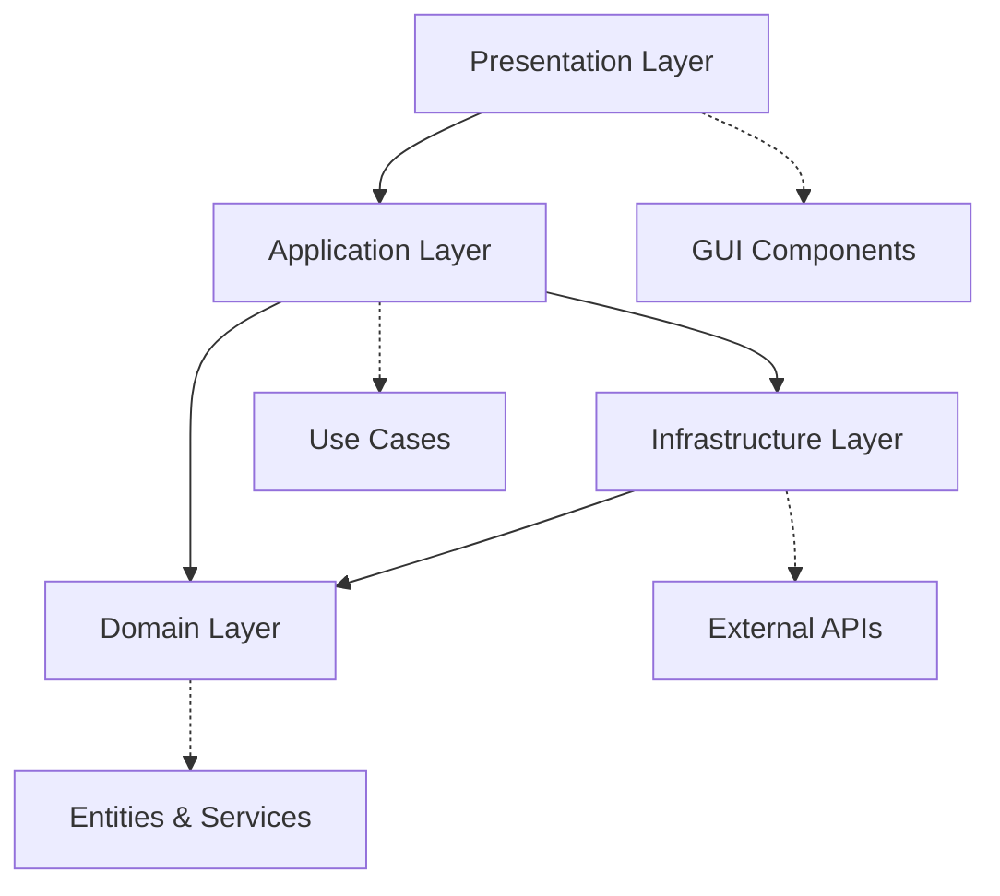

# 🏗️ PYSYSTEM Architecture Documentation

## Overview

PYSYSTEM follows **Clean Architecture** principles with **Domain-Driven Design (DDD)** patterns, ensuring maintainability, testability, and scalability.

## 📋 Table of Contents

1. [Architecture Layers](#architecture-layers)
2. [Design Patterns](#design-patterns)
3. [Dependency Flow](#dependency-flow)
4. [Data Flow](#data-flow)
5. [Component Interactions](#component-interactions)
6. [Performance Optimizations](#performance-optimizations)
7. [Testing Strategy](#testing-strategy)

## 🏛️ Architecture Layers

### **Domain Layer** (`src/domain/`)
The core business logic layer containing:

- **Entities** - Core business objects with identity
- **Value Objects** - Immutable objects representing descriptive aspects
- **Repositories** - Abstract data access interfaces
- **Services** - Domain-specific business logic

```python
# Example: Product Entity
class Product(BaseEntity):
    def __init__(self, sku: str, name: str, price: Decimal, stock: int):
        self.sku = sku
        self.name = name  
        self.unit_price = price
        self.stock_quantity = stock
    
    def can_fulfill_order(self, quantity: int) -> bool:
        return self.stock_quantity >= quantity
```

### **Application Layer** (`src/application/`)
Orchestrates domain operations:

- **Use Cases** - Application-specific business rules
- **DTOs** - Data Transfer Objects for layer communication
- **Interfaces** - Contracts for external dependencies

```python
# Example: Create Sales Order Use Case
class CreateSalesOrderUseCase:
    def __init__(self, order_repo: SalesOrderRepository, 
                 product_repo: ProductRepository):
        self._order_repo = order_repo
        self._product_repo = product_repo
    
    def execute(self, request: CreateOrderRequest) -> OrderDTO:
        # Business logic orchestration
        pass
```

### **Infrastructure Layer** (`src/infrastructure/`)
Technical implementation details:

- **External Services** - API integrations (BrasilAPI)
- **Persistence** - JSON file-based data storage
- **File Processors** - Excel import/export handlers

```python
# Example: BrasilAPI Service
class BrasilApiService:
    def lookup_address_by_cep(self, cep: str) -> Optional[Dict]:
        # External API integration with caching
        pass
```

### **Presentation Layer** (`src/presentation/`)
User interface and interaction:

- **GUI** - Tkinter-based interface components
- **Controllers** - Handle user interactions
- **Validators** - Input validation and formatting

```python
# Example: Company Controller
class CompanyController:
    def __init__(self, company_use_cases: CompanyUseCases):
        self._use_cases = company_use_cases
    
    def create_company(self, company_data: Dict) -> None:
        # Handle GUI interaction
        pass
```

## 🎯 Design Patterns

### **Repository Pattern**
Abstracts data access logic:

```python
class CompanyRepository(ABC):
    @abstractmethod
    def save(self, company: Company) -> Company:
        pass
    
    @abstractmethod
    def find_by_id(self, company_id: str) -> Optional[Company]:
        pass
```

### **Dependency Injection**
Manages object dependencies:

```python
class DependencyContainer:
    def __init__(self):
        self._company_repo = JsonCompanyRepository()
        self._company_use_cases = CompanyUseCases(self._company_repo)
        self._company_controller = CompanyController(self._company_use_cases)
```

### **Observer Pattern**
GUI updates and notifications:

```python
class Observable:
    def __init__(self):
        self._observers = []
    
    def notify(self, event: str, data: Any):
        for observer in self._observers:
            observer.update(event, data)
```

### **Factory Pattern**
Object creation and configuration:

```python
class EntityFactory:
    @staticmethod
    def create_company(data: Dict) -> Company:
        return Company(
            name=data['name'],
            document=Document(data['cnpj']),
            address=Address(**data['address'])
        )
```

## 🔄 Dependency Flow



**Key Principles:**
- **Inner layers** don't depend on outer layers
- **Dependencies** flow inward toward the domain
- **Interfaces** define contracts between layers
- **Dependency Inversion** enables testability

## 📊 Data Flow

### **Create Company Flow**
1. **GUI** - User enters company data
2. **Controller** - Validates input and calls use case
3. **Use Case** - Applies business rules
4. **Repository** - Persists data to JSON
5. **External Service** - Validates CNPJ via BrasilAPI
6. **GUI** - Updates interface with result

```python
# Simplified flow
def create_company_flow():
    # 1. GUI captures input
    company_data = gui.get_company_form_data()
    
    # 2. Controller validates
    controller.validate_input(company_data)
    
    # 3. Use case processes
    result = use_case.create_company(company_data)
    
    # 4. Repository persists
    repository.save(result.company)
    
    # 5. GUI updates
    gui.refresh_company_list()
```

## 🔧 Component Interactions

### **Core Components**

#### **Main Window**
- Central GUI coordinator
- Manages tab navigation
- Handles global events

#### **Frame Components**
- **CompanyManagementFrame** - Company CRUD operations
- **ProductManagementFrame** - Product and inventory management
- **SalesOrderFrame** - Order processing and management

#### **Service Layer**
- **AddressLookupService** - CEP to address resolution
- **ReportGenerationService** - PDF report creation
- **ExcelProcessingService** - File import/export

### **Integration Points**

#### **BrasilAPI Integration**
```python
class BrasilApiIntegration:
    """Handles all Brazilian API integrations"""
    
    def validate_cep(self, cep: str) -> AddressInfo:
        # CEP validation and address lookup
        pass
    
    def validate_cnpj(self, cnpj: str) -> CompanyInfo:
        # CNPJ validation and company data retrieval
        pass
```

#### **Data Persistence**
```python
class JsonPersistence:
    """JSON-based data storage with backup"""
    
    def save(self, entity_type: str, data: Dict) -> None:
        # Atomic save with backup
        pass
    
    def load(self, entity_type: str) -> List[Dict]:
        # Load with error recovery
        pass
```

## ⚡ Performance Optimizations

### **Caching Strategy**
- **Memory Cache** - Frequently accessed data
- **File Cache** - API responses with TTL
- **Lazy Loading** - Load data on demand

### **Data Loading**
- **Pagination** - Handle large datasets
- **Batch Processing** - Bulk operations
- **Background Loading** - Non-blocking operations

### **GUI Optimizations**
- **Virtual Scrolling** - Large lists
- **Debounced Search** - Reduce API calls
- **Progressive Loading** - Incremental data display

## 🧪 Testing Strategy

### **Test Pyramid**

#### **Unit Tests (70%)**
- Domain entities and value objects
- Use cases and business logic
- Individual components and services

```python
def test_product_can_fulfill_order():
    product = Product(sku="TEST-001", stock=10)
    assert product.can_fulfill_order(5) == True
    assert product.can_fulfill_order(15) == False
```

#### **Integration Tests (20%)**
- Component interactions
- External API integrations
- Data persistence layer

```python
def test_create_company_integration():
    # Test full flow from controller to repository
    result = company_controller.create_company(test_data)
    assert result.success == True
    assert repository.find_by_id(result.company.id) is not None
```

#### **E2E Tests (10%)**
- Full application workflows
- GUI interactions
- System-level validation

```python
def test_complete_sales_order_flow():
    # Test complete order creation workflow
    # From company selection to order persistence
    pass
```

### **Test Automation**
- **126 automated tests** with 99.2% coverage
- **Continuous integration** ready
- **Performance benchmarks** included
- **Mock external dependencies** for reliability

## 📈 Scalability Considerations

### **Horizontal Scaling**
- **Modular Architecture** - Easy to extract services
- **Interface-based Design** - Swap implementations
- **Configuration Management** - Environment-specific settings

### **Vertical Scaling**
- **Memory Management** - Efficient object lifecycle
- **Database Optimization** - Indexed JSON queries
- **Caching Layers** - Multiple levels of caching

### **Future Enhancements**
- **Database Migration** - From JSON to SQL
- **API Server** - REST/GraphQL endpoints
- **Microservices** - Service extraction
- **Real-time Updates** - WebSocket integration

## 🔐 Security Architecture

### **Input Validation**
- **Sanitization** at presentation layer
- **Business Rules** at domain layer
- **Data Integrity** at persistence layer

### **External API Security**
- **Rate Limiting** - Prevent abuse
- **Timeout Controls** - Prevent hanging
- **Error Handling** - Secure error messages

### **Data Protection**
- **Input Encoding** - Prevent injection
- **File Validation** - Safe file processing
- **Audit Logging** - Track all changes

## 📚 References

- **Clean Architecture** by Robert C. Martin
- **Domain-Driven Design** by Eric Evans
- **Python Best Practices** - PEP 8, PEP 257
- **GUI Architecture Patterns** - MVP, Observer
- **API Design** - RESTful principles

---

**This documentation is maintained as part of the PYSYSTEM project and should be updated with architectural changes.**
